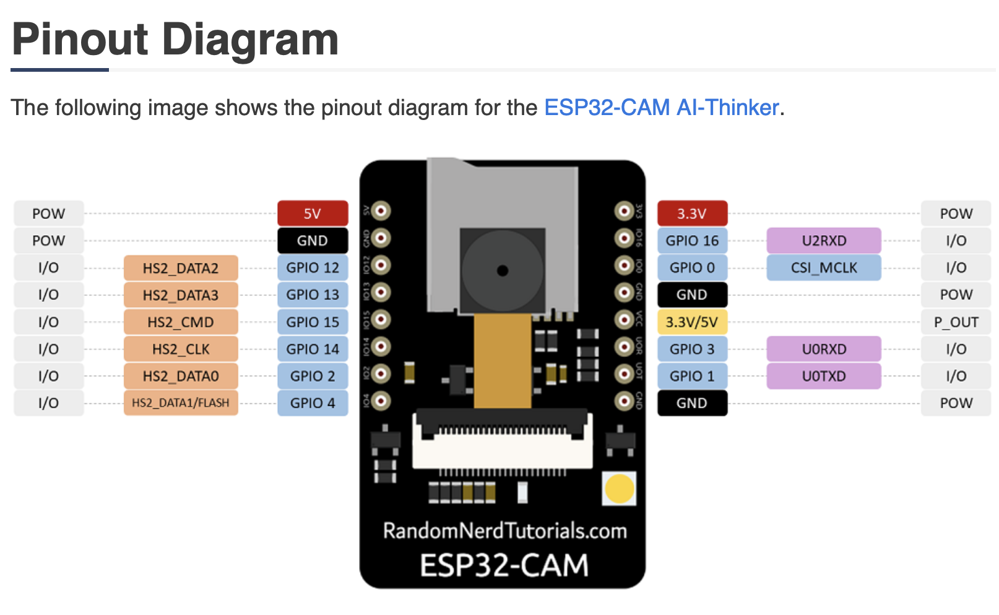

### ESP32 Camera

ESP32 Camera, from generic manufactureres is pretty bad. 

* Remember to set rate to 30 frames a second
* Use 5v to power the module
* The Camera streaming is blocking, so use async web lib, to stream camera.

#### ESP32 AI Thinker HW-818 generic module
